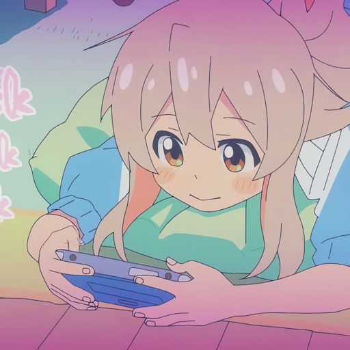

<h1 align="center">👋 Hello! I'm Yago M. Nunes</h1>

  
  

---

  

### 🌟 About me
Studying a Bachelor's degree in Computer Science, I love programming, drawing, reading (both books and manga), watching movies and anime. Most of my free time I spend programming, whether during a class break or while I'm on the bus, when I get tired I do these other things that I mentioned that I also like to do.

---

### 🚀 Highlighted Projects
| Project | Description |
| ------- | --------- |
| **🌱 Once Human** | Made in Godot, 2D game, top down, with a theme about recycling, product life cycle and Green IT practices in a fun way! |
| **🏜️ The Other Side Of West** | Made in Java, 2D game, top down, with a theme about old west, can you survive till the end? |
| **☕ Frameja** | Developing a framework to simplify the development of 2D games in Java. |
| **🐉 Learn Japanese Alphabets** | In a simple way, helps you to learn both, Hiragana and Katakana. |

---

### 🛠️ Main Languages

---

### 🤝 Conect with me!
Feel free to explore my repositories, I hope you find something that you like or that maybe is useful for you. My Discord is "thenoth". Check my social medias:

  
  
  
  

---

<em>“Live your life wisely.”</em>

